# 📚 **Apargo – Property Management Portal**

**Version:** `v1.5.0 - 2025-11-19` | [CHANGELOG](./CHANGELOG.md)

[](https://app.netlify.com/projects/apargo/deploys)

---

## 📖 Table of Contents

1. [Project Overview](#1-project-overview)
   - [Latest Features (v1.5.0)](#11-latest-features-v150)
2. [Architecture & Routing Model](#2-architecture--routing-model)
3. [Environment Variables & Service-Account Handling](#3-environment-variables--service-account-handling)
4. [Local Firebase Emulator](#4-local-firebase-emulator)
5. [Key Components & Modules](#5-key-components--modules)
6. [API Routes Overview](#6-api-routes-overview)
7. [Firebase Security Rules](#7-firebase-security-rules)
8. [Development Setup](#8-development-setup)
9. [Running TypeScript-based Scripts](#9-running-typescript-based-scripts)
10. [Post-build Cleanup Details](#10-post-build-cleanup-details)
11. [Thin-Client / Heavy-Server Pattern](#11-thin-client-heavy-server-pattern)
12. [Service-Worker Registration & Build-time Injection](#12-service-worker-registration-build-time-injection)
13. [Continuous Integration (GitHub Actions)](#13-continuous-integration-github-actions)
14. [Testing Strategy](#14-testing-strategy)
15. [Linting & CI Enforcement](#15-linting-ci-enforcement)
16. [Common Issues & Fixes](#16-common-issues-fixes)
17. [Deployment Checklist Failures & Custom-Claim Assignment#17-deployment-checklist-failures-custom-claim-assignment)
18. [Contribution Guidelines](#18-contribution-guidelines)
19. [Versioning & Release Process](#19-versioning-release-process)
20. [Best Practices & Accessibility](#20-best-practices-accessibility)
21. [Glossary](#21-glossary)
22. [File-Level Documentation Index](#22-file-level-documentation-index)
23. [Docker Build Guide](#23-docker-build-guide)

---

## 1. Project Overview

| Item                | Description                                                                                                                                                                                                                                                                                                                                                                                             |
| ------------------- | ------------------------------------------------------------------------------------------------------------------------------------------------------------------------------------------------------------------------------------------------------------------------------------------------------------------------------------------------------------------------------------------------------- |
| **Purpose**         | A web-based property-management portal that lets residents and administrators view dashboards, file fault reports, track expenses, receive real-time push notifications, and interact with data stored in Firebase.                                                                                                                                                                                     |
| **Primary Stack**   | **React 18** + **Next.js 16 (App Router with Turbopack)**, **TypeScript 5**, **Tailwind CSS**, **Firebase 11** (Client + Admin SDK), **Radix UI** components, **TanStack React Query** for data fetching, **Service Workers** for offline support, **Jest** for unit testing, **Recharts** for analytics visualization, and a set of **Node.js** scripts for deployment, data-seeding, and maintenance. |
| **Target Audience** | Residents, property managers and administrators of an apartment complex. The UI is a responsive SPA that works on desktop and mobile browsers.                                                                                                                                                                                                                                                          |
| **Key Use-Cases**   | • Dashboard-viewing with real-time analytics<br>• Fault reporting (auto-submit on file upload)<br>• Expense tracking with category breakdown<br>• Payment event management<br>• Real-time notifications<br>• Admin management of user-apartment assignments<br>• Community features (announcements, polls)<br>• Maintenance task scheduling<br>• Vendor management                                      |

---

### 1.1 Latest Features (v1.5.0)

This version introduces several major enhancements to the property management platform:

#### 🎯 Real-time Analytics Dashboard

- **Live spending insights** with trend analysis and velocity tracking
- **Interactive charts** powered by Recharts with category breakdowns
- **Real-time data freshness indicators** showing data age (fresh/recent/stale)
- **Spending velocity metrics** tracking weekly and monthly patterns
- **Category-wise expense analysis** with visual progress indicators

#### 🏘️ Community Features

- **Announcements system** for property-wide communications
- **Polls and voting** for community decision-making
- **Active announcements panel** on the dashboard
- **Community engagement tracking**

#### 💰 Enhanced Payment Management

- **Payment events tracking** with detailed transaction history
- **Payment scheduling** for recurring expenses
- **Category-based payment organization**
- **Payment analytics** and reporting

#### 🔧 Maintenance & Vendor Management

- **Maintenance task scheduling** with status tracking
- **Vendor management system** with ratings and reviews
- **Budget tracking** for maintenance activities
- **Task completion monitoring** with upcoming, completed, and skipped tasks

#### ⚡ Performance & Developer Experience

- **Turbopack integration** for faster development builds
- **React Query** for optimized data fetching and caching
- **Radix UI components** for accessible, high-quality UI primitives
- **pnpm** as the package manager for faster, more efficient installs
- **Enhanced TypeScript support** with strict mode enabled

---

## 2. Architecture & Routing Model

> **⚡ TL;DR:** The project **uses the Next.js App Router exclusively**. The legacy `src/pages` folder is kept only for a few **static files** that have not yet been migrated.

### 2.1 Folder Layout & Routing

```
src/
├─ app/               – App Router pages & server actions
│   ├─ (dashboard)/page.tsx   → /dashboard
│   ├─ (login)/page.tsx       → /login
│   └─ api/...                → Server-only API routes (exposed as /api/**)
├─ components/        – Re-usable UI components (organized by feature)
│   ├─ admin/         – Admin dashboard & tools
│   ├─ analytics/     – Analytics dashboard & charts
│   ├─ auth/          – Authentication forms
│   ├─ community/     – Community features (announcements, polls)
│   ├─ core/          – Core app shell & providers
│   ├─ dashboard/     – Dashboard widgets
│   ├─ maintenance/   – Maintenance & vendor management
│   ├─ payment-events/– Payment event tracking
│   ├─ ui/            – Radix UI primitives
│   └─ ...
├─ lib/               – Core logic & utilities (organized by feature)
│   ├─ auth/          – Authentication logic
│   ├─ core/          – Core constants & types
│   ├─ firebase/      – Firebase SDK initialization
│   ├─ firestore/     – Data access layer
│   └─ ...
public/
├─ sw-optimized.js   – Production service-worker
├─ sw.js              – Fallback service-worker
├─ firebase-messaging-sw.js   – FCM worker (v11 compat)
├─ firebase-messaging-sw.js (legacy v8) – kept for reference only
└─ …                  – Static assets (icons, test pages, etc.)
scripts/               – Maintenance / seeding scripts
tests/                 – Jest unit-test suites
.next/                 – Generated build artefacts
...
```

### 2.2 Legacy `src/pages` folder

- **What it contains:** Only static files such as `robots.txt` or legacy HTML that were never part of the App Router.
- **Important:** **Next.js never serves files from `src/pages` as static assets.** If you need a file to be publicly reachable, move it to `public/` or delete it.
- **Migration tip:** Run the following once to spot any stray files:

```bash
git ls-files src/pages | xargs -I{} echo "⚠️ Legacy file: {} – move to public/ or delete"
```

### 2.3 Bundle-Analyzer (`ANALYZE`)

The **`ANALYZE`** environment variable toggles the built-in bundle-analyzer:

```bash
ANALYZE=true pnpm run build
```

- When `ANALYZE` is `true` the analyzer opens in the browser after the build finishes.
- **Side-effect:** The analyzer disables the _post-build cleanup_ (see §10) because the cleanup would delete the source-map files the analyzer needs.

---

## 3. Environment Variables & Service-Account Handling

> **⚠️ Security Reminder:** Only the `NEXT_PUBLIC_*` variables are committed to the repo. All **private** credentials are ignored via `.gitignore` and injected at runtime (CI or local dev).

| Variable                                   | Purpose                                                                                                | Example                     | Required?  |
| ------------------------------------------ | ------------------------------------------------------------------------------------------------------ | --------------------------- | ---------- |
| `NEXT_PUBLIC_FIREBASE_API_KEY`             | Public Firebase API key                                                                                | `AIzaSy...`                 | ✅         |
| `NEXT_PUBLIC_FIREBASE_AUTH_DOMAIN`         | Auth domain (e.g. `myapp.firebaseapp.com`)                                                             | `myapp.firebaseapp.com`     | ✅         |
| `NEXT_PUBLIC_FIREBASE_PROJECT_ID`          | Firebase project identifier                                                                            | `myapp`                     | ✅         |
| `NEXT_PUBLIC_FIREBASE_STORAGE_BUCKET`      | Cloud Storage bucket name                                                                              | `myapp.appspot.com`         | ✅         |
| `NEXT_PUBLIC_FIREBASE_MESSAGING_SENDER_ID` | FCM sender ID                                                                                          | `1234567890`                | ✅         |
| `NEXT_PUBLIC_FIREBASE_APP_ID`              | Firebase app ID                                                                                        | `1:1234567890:web:abcd1234` | ✅         |
| `NEXT_PUBLIC_FIREBASE_VAPID_KEY`           | Web-push VAPID key for FCM                                                                             | `BEs…`                      | ✅         |
| `NEXT_PUBLIC_APP_APARTMENT_COUNT`          | Number of apartments the complex has (drives ID generation)                                            | `12`                        | ✅         |
| `NEXT_PUBLIC_SW_VERSION`                   | Cache-busting version for the service worker. Default: **`"1"`** (set in `scripts/replace-sw-env.js`). | `2025-10-30`                | _optional_ |
| `NEXT_PUBLIC_FIREBASE_EMULATOR_HOST`       | **Client-side** emulator host (Firestore).                                                             | `localhost:9099`            | _optional_ |
| `FIREBASE_EMULATOR_HOST`                   | **Admin-side** emulator host (used by `firebase-admin` scripts).                                       | `localhost:9099`            | _optional_ |
| `CI`                                       | Set by CI runners – scripts use it to fail fast on missing env vars.                                   | `true`                      | _internal_ |
| `FIREBASE_SERVICE_ACCOUNT`                 | **Base64-encoded** `apartgo.json` (service-account) – **used only in CI**                              | `eyJ…`                      | _internal_ |

### 3.1 Where to obtain `apartgo.json`

1. In the Firebase console, go to **Project Settings → Service accounts**.
2. Click **Generate new private key** → download the JSON file.
3. Rename it to `apartgo.json` and place it in the repository root **(never commit it!).**

### 3.2 CI handling of the service-account

The GitHub-Actions workflow decodes the secret and writes the file before any admin script runs:

```bash
echo "$FIREBASE_SERVICE_ACCOUNT" | base64 --decode > apartgo.json
```

### 3.3 Default value for `NEXT_PUBLIC_SW_VERSION`

The default `"1"` is injected by **`scripts/replace-sw-env.js`**:

```js
const envVars = {
  // …
  NEXT_PUBLIC_SW_VERSION: process.env.NEXT_PUBLIC_SW_VERSION || '1',
};
```

The value is concatenated into the service-worker cache name (`apargo-v${SW_VERSION}`) to force a cache bust on every version bump.

### 3.4 Authentication & Authorization Flow

The application implements a **session-based authentication system** with Firebase as the identity provider. Below are the key flows:

#### Email/Password Login Flow


#### Google OAuth Login Flow


#### Authorization & Access Control


#### Logout & Session Cleanup


#### Session Validation on App Load


#### Custom Claims for Authorization

Firebase custom claims are assigned via the `scripts/set-custom-claims.ts` script:

```bash
tsx scripts/set-custom-claims.ts <uid> <apartmentId> [role]
```

These claims are embedded in the ID token and used by Firestore security rules:

```mermaid
graph LR
    A["User logs in<br/>(has custom claims)"] -->|ID Token with claims| B["verifyIdToken()"]
    B -->|Claims embedded| C["request.auth.token"]
    C -->|apartmentId claim| D["Firestore Rules<br/>Check apartment access"]
    C -->|role claim| E["Firestore Rules<br/>Check admin access"]
    D -->|Matches doc apartment| F["✓ Access Granted"]
    D -->|No match| G["✗ Access Denied"]
    E -->|role == 'admin'| H["✓ Bypass apartment check"]
    E -->|role != 'admin'| I["✓ Use apartment check"]
```



---

## 4. Local Firebase Emulator

Running the full Firebase suite locally speeds up onboarding and enables offline testing.

### 4.1 Prerequisites

```bash
pnpm add -g firebase-tools   # or add firebase-tools as a devDependency
```

### 4.2 Start the emulators

```bash
# From the repo root
firebase emulators:start --only auth,firestore,functions,hosting,storage
```

The emulator configuration lives in `firebase.json`. It mirrors the production rules, but **security rules are relaxed** for `auth` (any user can sign-in with any email/password) – this is intentional for rapid local dev.

### 4.3 Point the app at the emulator

Create a **`.env.local.emu`** file (git-ignored) that overrides the host URLs:

```bash
NEXT_PUBLIC_FIREBASE_EMULATOR_HOST=localhost:9099   # Firestore (client)
FIREBASE_EMULATOR_HOST=localhost:9099               # Admin SDK scripts
NEXT_PUBLIC_FIREBASE_AUTH_EMULATOR_HOST=localhost:9099
NEXT_PUBLIC_FIREBASE_STORAGE_EMULATOR_HOST=localhost:9199
NEXT_PUBLIC_FIREBASE_MESSAGING_EMULATOR_HOST=localhost:5001
```

Load it before starting the dev server:

```bash
export $(cat .env.local.emu | xargs) && pnpm run dev
```

When the `*_EMULATOR_HOST` vars are present, `src/lib/firebase.ts` automatically connects the client SDK to the emulator, and any **admin** scripts (e.g., `scripts/check-database.js`) use `FIREBASE_EMULATOR_HOST`.

---

## 5. Key Components & Modules

> **NOTE:** Long descriptions are now bullet-point lists for quick scanning.

| File                                                                                                              | Role / Description                                                                                                                                                                                                                                                       |
| ----------------------------------------------------------------------------------------------------------------- | ------------------------------------------------------------------------------------------------------------------------------------------------------------------------------------------------------------------------------------------------------------------------ |
| **`next.config.ts`**                                                                                              | • Enables React strict mode & gzip compression.<br>• Adds the bundle-analyzer (`ANALYZE` env var).<br>• Marks `firebase-admin` as external for serverless builds.<br>• `output: 'standalone'` is **commented** – uncomment for Docker builds.                            |
| **`tailwind.config.ts`**                                                                                          | • Dark-mode via `class`.<br>• `content` includes `src/app`, `src/components`, and **static HTML** (`public/**/*.html`).<br>• Exposes design tokens as CSS variables (`--primary`, `--background`, …).                                                                    |
| **`src/lib/firebase/firebase.ts`**                                                                                | Initializes the Firebase **client** app from the public config; exports ready-to-use `auth`, `firestore`, `messaging`.                                                                                                                                                   |
| **`src/lib/firebase/firebase-admin.ts`**                                                                          | Singleton **Admin** app; reads the service-account (`apartgo.json`). All Node scripts import `getFirebaseAdminApp()` from here.                                                                                                                                          |
| **`src/lib/core/apartment-constants.ts`**                                                                         | Helper that computes `getApartmentCount()` and `getApartmentIds()` from `NEXT_PUBLIC_APP_APARTMENT_COUNT`.                                                                                                                                                               |
| **`src/lib/auth/auth.ts`**                                                                                        | Custom hook that:<br>• Persists the Firebase Auth user in `localStorage`.<br>• Subscribes to `onAuthStateChanged` (mocked in tests).                                                                                                                                     |
| **`src/components/**`\*\*                                                                                         | Small, focused UI components (Buttons, Cards, Form fields, etc.).                                                                                                                                                                                                        |
| **`src/components/analytics/analytics-view.tsx`**                                                                 | **Real-time analytics dashboard** with:<br>• Live spending insights and trend analysis<br>• Interactive Recharts visualizations<br>• Category breakdowns with progress indicators<br>• Spending velocity tracking                                                        |
| **`src/components/admin/admin-view.tsx`**                                                                         | **Admin dashboard** with tabs for:<br>• User management<br>• Category management<br>• Payment events<br>• Community features (announcements, polls)                                                                                                                      |
| **`src/components/maintenance/maintenance-dashboard.tsx`**                                                        | **Maintenance management** with:<br>• Task scheduling and tracking<br>• Budget summaries<br>• Upcoming, completed, and skipped tasks sections                                                                                                                            |
| **`src/components/maintenance/vendor-list.tsx`**                                                                  | **Vendor management** with ratings, status badges, and contact information.                                                                                                                                                                                              |
| **`src/components/community/**`\*\*                                                                               | Community features including announcements and polls for resident engagement.                                                                                                                                                                                            |
| **`src/components/payment-events/**`\*\*                                                                          | Payment event tracking and management components.                                                                                                                                                                                                                        |
| **`public/sw-optimized.js`**                                                                                      | Production service-worker with three caching strategies:<br>• **static** – `cacheFirst` (assets that never change).<br>• **api** – `networkFirst` (always try network, fall back to cache).<br>• **pages** – `staleWhileRevalidate` (serve cache, update in background). |
| **`public/sw.js`**                                                                                                | Fallback service-worker using a simple **cache-first** strategy (kept for browsers that can't load the optimized version).                                                                                                                                               |
| **`public/firebase-messaging-sw.js`**                                                                             | Deployed FCM worker (Firebase v11-compat). It receives the **build-time-injected** config from `replace-sw-env.js`.                                                                                                                                                      |
| **`firebase/firebase-messaging-sw.js`**                                                                           | **Legacy v8 worker** – retained **only for reference** while the team migrates to v11. It can be removed in a future major version.                                                                                                                                      |
| **`scripts/replace-sw-env.js`**                                                                                   | Reads the public environment variables at build time and injects them into the two SW files (`firebase-messaging-sw.js` and `sw-optimized.js`).                                                                                                                          |
| **`scripts/post-build-cleanup.js`**                                                                               | Deletes heavy caches, strips source-maps, and adds a minimal serverless-optimisation shim.                                                                                                                                                                               |
| **`scripts/check-database.js`**                                                                                   | Connects via Admin SDK, prints a quick health-check of `users` and recent `notifications`.                                                                                                                                                                               |
| **`scripts/clean-fcm-tokens.ts`**                                                                                 | Iterates over all users, validates each FCM token with the Admin SDK, and removes invalid ones.                                                                                                                                                                          |
| **`scripts/fix-notifications-display.js`**                                                                        | Browser-side script that normalises the `apartment` / `apartmentId` fields stored in `localStorage` after a schema change.                                                                                                                                               |
| **`scripts/fix-user-apartments.ts`**                                                                              | Audits and repairs missing `apartment` fields in the `users` collection.                                                                                                                                                                                                 |
| **`scripts/insertUsers.ts`**, **`insertApartments.ts`**, **`insertCategories.ts`**, **`insertSampleExpenses.ts`** | Seed data helpers used during onboarding or CI.                                                                                                                                                                                                                          |
| **`scripts/set-custom-claims.ts`**                                                                                | **(New)** Assigns `apartmentId` + `role` custom claims to a Firebase Auth user (see § 17).                                                                                                                                                                               |
| **`scripts/test-payment-events.js`**, **`test-payment-scheduler.js`**                                             | Test scripts for payment event workflows and scheduling functionality.                                                                                                                                                                                                   |
| **`scripts/optimize.js`**, **`netlify-optimize.js`**                                                              | Additional optional optimisation helpers for CI/CD.                                                                                                                                                                                                                      |
| **`tests/**`\*\*                                                                                                  | Jest unit-test suites (see § 14).                                                                                                                                                                                                                                        |

---

## 6. API Routes Overview

All server-only endpoints live under **`src/app/api`** and are automatically exposed as `/api/...`.

| Method   | Path                      | Description                                                   | Auth Required?       |
| -------- | ------------------------- | ------------------------------------------------------------- | -------------------- |
| **GET**  | `/api/health`             | Simple health-check; returns `{ ok: true }`.                  | No                   |
| **GET**  | `/api/auth/session`       | Returns the current Firebase session cookie (used by SSR).    | Yes – session cookie |
| **POST** | `/api/auth/login`         | Exchanges an email/password for a Firebase custom token.      | No                   |
| **POST** | `/api/faults`             | Creates a new fault report (optional image upload).           | Yes – resident       |
| **GET**  | `/api/expenses`           | Lists expenses visible to the caller’s apartment.             | Yes – resident       |
| **POST** | `/api/expenses`           | Creates a new expense (admin only).                           | Yes – admin          |
| **GET**  | `/api/notifications`      | Retrieves recent push notifications for the user’s apartment. | Yes – resident       |
| **POST** | `/api/notifications/test` | Sends a test push message (admin).                            | Yes – admin          |
| …        | _Other routes_            | See the `src/app/api` folder for the full list.               | —                    |

---

## 7. Firebase Security Rules

- **Location:** `firestore.rules` (project root).
- **Deploying:**

```bash
# Deploy only Firestore rules
firebase deploy --only firestore:rules
```

### Core concepts

| Rule                                                        | Meaning                                                       |
| ----------------------------------------------------------- | ------------------------------------------------------------- |
| `request.auth != null`                                      | Only authenticated users can read/write.                      |
| `resource.data.apartment == request.auth.token.apartmentId` | Users can only access docs that belong to their apartment.    |
| `request.auth.token.role == "admin"`                        | Users with the `admin` custom claim bypass apartment scoping. |

> **Tip:** The `firebase.json` file also contains `hosting` rewrites that forward `/api/**` to the Next.js server and serve the service-worker files from the root.

---

## 8. Development Setup

```bash
# 1️⃣ Prerequisites
#    - Node.js ≥ 20.9.0 (as specified in package.json engines)
#    - pnpm (package manager)
#    - A Firebase project with Firestore, Auth & Cloud Messaging enabled
#    - `apartgo.json` (service-account) placed at the repo root (git-ignored)

# 2️⃣ Install pnpm (if not already installed)
npm install -g pnpm
# or via Corepack (recommended for Node.js ≥ 16.13)
corepack enable

# 3️⃣ Install the project
git clone https://github.com/yourorg/apargo.git
cd apargo
pnpm install   # clean install, respects lockfile

# 4️⃣ Install the TypeScript-runner used by scripts
pnpm add -D tsx          # local dev dependency (preferred)
# If you prefer a global install:
# pnpm add -g tsx

# 5️⃣ Environment
cp .env.example .env.local
#   Edit .env.local and fill in the public Firebase values + APP_APARTMENT_COUNT
#   (Optional) If you want to work against the emulator, also copy .env.example .env.local.emu

# 6️⃣ Development server
pnpm run dev       # starts Next.js on http://localhost:3000 with Turbopack

# 7️⃣ Production build (includes post-build cleanup)
pnpm run build

# 8️⃣ Serve the production build locally
pnpm run start
```

### 8.1 Running the Service-Worker locally

`next dev` serves the **entire `public/` directory as-is**, so the service-worker files are already reachable:

```
http://localhost:3000/sw-optimized.js
http://localhost:3000/sw.js
http://localhost:3000/firebase-messaging-sw.js
```

You can open the browser console and verify that the registration code (see § 12.1) successfully registers the worker.

---

## 9. Running TypeScript-based Scripts

Many maintenance/seeding scripts are written in **TypeScript**. They must be executed with a runtime that can transpile on-the-fly (`tsx`).

```bash
# Generic pattern
tsx scripts/<script>.ts
```

**Example shortcuts** (already defined in `package.json`):

```bash
pnpm run insert-users          # inserts demo users
pnpm run insert-apartments     # generates apartments collection
pnpm run insert-categories     # populates expense categories
pnpm run seed:expenses         # inserts sample expenses (if available)
pnpm run fix-apartments        # validates & repairs missing apartment assignments (if available)
pnpm run clean-fcm             # removes invalid FCM tokens (if available)
pnpm run deployment-checklist  # runs pre-deploy sanity checks (if available)
```

> **Why `tsx`?** It uses `esbuild` under the hood, providing near-instant start-up and full TypeScript support without a separate compile step.

---

## 10. Post-build Cleanup Details

The cleanup that removes webpack/Eslint caches and source-maps is hooked into **npm’s `postbuild` lifecycle**.

### What the script does

1. **Deletes heavy caches** – `./.next/cache/webpack`, `./.next/cache/eslint`.
2. **Strips source-maps** – removes any `*.map` files under `.next/static` when `NODE_ENV=production`.
3. **Adds a minimal serverless optimisation file** (`.next/standalone/optimize.js`) that forces the import of a tiny “node-optimization” shim (used by the standalone build).

### Interaction with `ANALYZE`

When `ANALYZE=true` the bundle analyzer is active **and the post-build cleanup is intentionally skipped** so that source-maps remain for the visualisation. The script respects this automatically.

### Skipping the cleanup manually

If you need the build artefacts for local debugging, run:

```bash
pnpm run build --ignore-scripts   # bypasses all lifecycle scripts
```

> **Caution:** Skipping the cleanup will increase bundle size and may cause CI-related timeouts on Netlify.

---

## 11. Thin-Client / Heavy-Server Pattern

> **What does this mean?** UI components are intentionally lightweight; any heavy data-manipulation or bulk writes are performed by **admin scripts** or server-only API routes.

| Area                   | Thin-Client Example                                              | Heavy-Server Example                                                                                                       |
| ---------------------- | ---------------------------------------------------------------- | -------------------------------------------------------------------------------------------------------------------------- |
| **User onboarding**    | A sign-up form that calls `createUserWithEmailAndPassword`.      | `scripts/insertUsers.ts` bulk-creates many demo users in a single batch.                                                   |
| **Apartment creation** | UI only shows a list of generated IDs (`getApartmentIds()`).     | `scripts/insertApartments.ts` writes every ID to Firestore in one transaction.                                             |
| **Expense splitting**  | UI renders expense rows, calculates per-apartment share locally. | `scripts/fix-user-apartments.ts` audits the entire `users` collection to repair missing apartment fields.                  |
| **FCM token cleanup**  | UI never touches tokens directly.                                | `scripts/clean-fcm-tokens.ts` iterates over all users, validates each token with Firebase Admin, and removes invalid ones. |

### Running heavy scripts in production

Add the `--env prod` flag to any script that must target the **production** Firebase project:

```bash
FIREBASE_SERVICE_ACCOUNT=$PROD_SA_BASE64 CI=true NODE_ENV=production tsx scripts/insertUsers.ts
```

The script reads the base-64 secret from the CI environment and connects to the live project.

---

## 12. Service-Worker Registration & Build-time Injection

### 12.1 Registration code (place in a top-level component, e.g., `src/app/layout.tsx`)

```tsx
useEffect(() => {
  if ('serviceWorker' in navigator) {
    // Register the optimized worker first; fallback to sw.js if it fails
    navigator.serviceWorker
      .register('/sw-optimized.js')
      .catch(() => navigator.serviceWorker.register('/sw.js'));
  }
}, []);
```

### 12.2 How `replace-sw-env.js` works

During `npm run build` the script:

1. Reads the **public** Firebase variables from `process.env`.
2. Opens `public/firebase-messaging-sw.js` and `public/sw-optimized.js`.
3. Replaces placeholder strings like `NEXT_PUBLIC_FIREBASE_API_KEY` with their **actual values** (or the literal `undefined` if missing).
4. Fails the build in CI if any **required** variable is absent.

> **Result:** Service workers can’t access `process.env` at runtime, but they receive the needed config values at build time.

### 12.3 `NEXT_PUBLIC_SW_VERSION` fallback

If `NEXT_PUBLIC_SW_VERSION` is **not** defined, `replace-sw-env.js` injects `"1"` as the default. The value is interpolated in the service-worker cache name:

```js
const CACHE_NAME = `apargo-v${process.env.NEXT_PUBLIC_SW_VERSION || '1'}`;
```

Changing the version (e.g., bumping it in `.env.local`) and rebuilding forces a **cache bust** on the next page load.

---

## 13. Continuous Integration (GitHub Actions)

**File:** `.github/workflows/ci.yml`

| Stage                | Command                                                                         |
| -------------------- | ------------------------------------------------------------------------------- |
| **Install**          | `pnpm install`                                                                  |
| **Lint**             | `pnpm run lint`                                                                 |
| **Test**             | `pnpm test` (Jest)                                                              |
| **Build**            | `pnpm run build` (production)                                                   |
| **Deploy (Netlify)** | Runs only on `main` after a successful build; uses `NETLIFY_AUTH_TOKEN` secret. |

### Required secrets (repo Settings → Secrets)

| Secret                     | Purpose                                                   |
| -------------------------- | --------------------------------------------------------- |
| `FIREBASE_SERVICE_ACCOUNT` | Base-64-encoded `apartgo.json`.                           |
| `NETLIFY_AUTH_TOKEN`       | Netlify personal access token for automated deploys.      |
| `NEXT_PUBLIC_FIREBASE_*`   | All public Firebase vars – safe to store as repo secrets. |

### Lint in CI

_Contrary to a previous comment, lint **is** executed in CI._ It fails the workflow if any ESLint error is reported, ensuring that no lint-only issues slip through.

---

## 14. Testing Strategy

### 14.1 Unit Tests (Jest)

- **Run all tests:** `pnpm test`
- **Watch mode:** `pnpm test -- --watch`
- **Coverage:** `pnpm test -- --coverage` (CI enforces `>80 %` line coverage).

The `jest.setup.ts` file **mocks** Firebase modules so unit tests run without network access. The mock includes the essential methods (`signInWithEmailAndPassword`, `signOut`, `addDoc`, `setDoc`, `getDoc`, …).

### 14.2 Integration / End-to-End Tests

- **Framework:** Playwright (optional, not shipped by default).
- **Installation:**

```bash
pnpm add -D @playwright/test
pnpm dlx playwright install
```

- **Run locally:** `pnpm run test:e2e` (add a script entry if you want).

### 14.3 Emulator-based testing

When testing code that talks to Firestore/Auth, spin up the emulator (see § 4) and point the client at it via the `*_EMULATOR_HOST` variables. This gives you a **real** backend without network latency.

---

## 15. Linting & CI Enforcement

- **`pnpm run lint`** runs `next lint` (ESLint with the Next.js preset).
- **Ignored files:** `.eslintignore` excludes generated files (`.next/`, `dist/`, `node_modules/`).
- **Scripts folder:** All scripts in `scripts/` **are linted** (they are part of the source tree). No explicit exclusion is required – this ensures that maintenance scripts stay clean.
- **CI behavior:** The GitHub Actions workflow **runs** lint; a lint failure aborts the workflow and blocks merges.

---

## 16. Common Issues & Fixes

| Symptom                                                   | Likely Cause                                                                                           | Fix                                                                                                                          |
| --------------------------------------------------------- | ------------------------------------------------------------------------------------------------------ | ---------------------------------------------------------------------------------------------------------------------------- |
| **Service worker fails to register**                      | Site served over HTTP, missing `/firebase-messaging-sw.js`, or `replace-sw-env.js` didn't inject vars. | Serve via HTTPS (Netlify does this automatically). Ensure a successful `pnpm run build` so the file is copied to the output. |
| **`process.env` variables are undefined in the SW**       | `replace-sw-env.js` didn't run (e.g., `ANALYZE` shortcut build).                                       | Run a full build: `pnpm run build`. In CI the script will abort if required vars are missing.                                |
| **TypeScript scripts error “Cannot find module …”**       | Running with plain `node`.                                                                             | Use `tsx` (installed locally or globally).                                                                                   |
| **Lint errors appear in CI but not locally**              | Local IDE may use a cached ESLint version.                                                             | Run `pnpm run lint` locally; fix any reported errors before pushing.                                                         |
| **Firebase Security Rules block reads**                   | User’s custom claim `apartmentId` missing.                                                             | Use the **Custom Claim Assignment** script (see § 17).                                                                       |
| **Post-build cleanup not executed**                       | `postbuild` script missing in `package.json`.                                                          | Add `"postbuild": "node scripts/post-build-cleanup.js"` (see § 10).                                                          |
| **`onAuthStateChanged` reference in docs**                | The hook still uses it; the mock is provided in `jest.setup.ts`.                                       | No action needed.                                                                                                            |
| **Missing `NEXT_PUBLIC_FIREBASE_EMULATOR_HOST`**          | Emulator config only set the admin variable.                                                           | Add the client-side variable to `.env.local.emu` (see § 4.3).                                                                |
| **`firebase/firebase-messaging-sw.js` present**           | Legacy file kept for reference.                                                                        | See § 5 for rationale; it can be removed in a future major version.                                                          |
| **`scripts/fix-notifications-display.js` not documented** | Was omitted from the index.                                                                            | Added description in § 5 and § 22.                                                                                           |
| **Docker build fails**                                    | `output: 'standalone'` is commented out.                                                               | Enable it (uncomment) and use the Dockerfile below.                                                                          |
| **Need to force a SW cache bust without a full release**  | Changing `NEXT_PUBLIC_SW_VERSION` manually.                                                            | Update the variable in `.env.local` and run `pnpm run build`.                                                                |

---

## 17. Deployment Checklist Failures & Custom-Claim Assignment

### 17.1 Checklist script failures you may see

| Failure                           | Explanation                                              | Remedy                                                                    |
| --------------------------------- | -------------------------------------------------------- | ------------------------------------------------------------------------- |
| **`netlify.toml` missing**        | The Netlify config isn’t present.                        | Add a minimal `netlify.toml` (see Docker guide for an example).           |
| **Plugin not configured**         | `@netlify/plugin-nextjs` missing.                        | Add it under `[plugins]` in `netlify.toml`.                               |
| **Standalone output not enabled** | `output: 'standalone'` is commented out.                 | Uncomment the line in `next.config.ts` if you need a Docker-ready bundle. |
| **Missing API route**             | Expected file (`src/app/api/health/route.ts`) not found. | Verify the file exists; run `pnpm run build` to surface routing errors.   |

### 17.2 Custom-Claim Assignment script

> **File:** `scripts/set-custom-claims.ts`  
> **Purpose:** Assigns `apartmentId` and `role` custom claims to a Firebase Auth user. This is required for the security rules that gate access by apartment.

```bash
# Example usage (run from the repo root)
tsx scripts/set-custom-claims.ts <uid> <apartmentId> [role]
#   <uid>         – Firebase Auth UID of the user
#   <apartmentId> – e.g. G1, F1, …
#   [role]        – optional, defaults to "resident"
```

The script reads the service-account (`apartgo.json`) via `src/lib/firebase-admin.ts`, so it works both locally (when the file exists) and in CI (when the base-64 secret is decoded).

---

## 18. Contribution Guidelines

See `CONTRIBUTING.md`. Below is a concise checklist:

1. **Fork** → **branch** (`git checkout -b feat/awesome-feature`).
2. Follow **TypeScript strict mode** and existing **ESLint** rules (`pnpm run lint`).
3. Write **unit tests** for new logic (≥ 80 % coverage).
4. Run the full suite locally: `pnpm test`.
5. Verify the **post-build cleanup** works (`pnpm run build`).
6. Open a PR against `main`. At least **one approving review** is required and the CI must pass.
7. Commit messages must follow **Conventional Commits** (`feat: …`, `fix: …`).

---

## 19. Versioning & Release Process

1. **Bump version** using pnpm (which updates `package.json` and creates a Git tag):

```bash
pnpm version patch   # or minor / major
git push --follow-tags
```

2. **Generate changelog** (automated via `standard-version` if installed):

```bash
npx changelog-generator -p    # prepend new entries to CHANGELOG.md
git add CHANGELOG.md
git commit -m "docs: update changelog for vX.Y.Z"
git push
```

3. **Deploy** – Netlify automatically picks up the new tag and runs the CI pipeline.

> **Since v1.4.2**, the version string is also injected into `NEXT_PUBLIC_SW_VERSION` (via `replace-sw-env.js`) to force a service-worker cache bust.

---

## 20. Best Practices & Accessibility

- **Tailwind purge** – Keep the `content` array up-to-date; missing paths cause dead CSS to linger.
- **WCAG AA contrast** – Use the **axe** Chrome extension or run `pnpm run lint:accessibility` (adds `eslint-plugin-jsx-a11y`).
- **ARIA** – Every interactive element must have an accessible name (`aria-label` or visible text).
- **Keyboard navigation** – All dialogs, menus and buttons must be reachable via `Tab`.
- **Testing** – Run `pnpm run lint && pnpm run test && pnpm run build && pnpm run start` locally; use Lighthouse to verify accessibility scores (`≥ 90`).

---

## 21. Glossary

| Acronym     | Meaning                                                                      |
| ----------- | ---------------------------------------------------------------------------- |
| **SW**      | Service Worker                                                               |
| **FCM**     | Firebase Cloud Messaging                                                     |
| **CI**      | Continuous Integration                                                       |
| **SSR**     | Server-Side Rendering (Next.js)                                              |
| **ANALYZE** | Environment variable that enables the bundle-analyzer plugin                 |
| **VAPID**   | Voluntary Application Server Identification (used for Web-Push)              |
| **TSX**     | TypeScript + JSX – file extension for React components written in TypeScript |
| **E2E**     | End-to-End testing (Playwright)                                              |

---

## 22. File-Level Documentation Index

| File                                                                                              | Primary purpose                                                                                               |
| ------------------------------------------------------------------------------------------------- | ------------------------------------------------------------------------------------------------------------- |
| `next-env.d.ts`                                                                                   | Global Next.js TypeScript definitions (auto-generated).                                                       |
| `next.config.ts`                                                                                  | Next.js configuration – React strict mode, compression, bundle analyser, optional `output: 'standalone'`.     |
| `tailwind.config.ts`                                                                              | Tailwind CSS config – dark mode, content paths, design tokens as CSS variables.                               |
| `tsconfig.json`                                                                                   | TypeScript compiler options (`strict`, path aliases).                                                         |
| `.eslintrc.js`                                                                                    | ESLint config – extends `next/core-web-vitals`.                                                               |
| `jest.config.js`                                                                                  | Jest config for Next.js + TypeScript.                                                                         |
| `jest.setup.ts`                                                                                   | Global Jest mocks for Firebase modules.                                                                       |
| `public/sw-optimized.js`                                                                          | Production service worker – implements **cacheFirst**, **networkFirst**, **staleWhileRevalidate** strategies. |
| `public/sw.js`                                                                                    | Fallback service worker – simple cache-first implementation.                                                  |
| `public/firebase-messaging-sw.js`                                                                 | Deployed FCM worker (v11-compat) – receives build-time-injected config.                                       |
| `firebase/firebase-messaging-sw.js`                                                               | **Legacy v8 worker** – retained only for reference while migrating to v11.                                    |
| `scripts/replace-sw-env.js`                                                                       | Injects public env vars into both SW files at build time; sets default `SW_VERSION` to `"1"`.                 |
| `scripts/post-build-cleanup.js`                                                                   | Removes caches, source-maps, adds a minimal serverless optimisation shim.                                     |
| `scripts/check-database.js`                                                                       | Quick health-check of `users` & recent `notifications`.                                                       |
| `scripts/clean-fcm-tokens.ts`                                                                     | Validates all stored FCM tokens; deletes those that are invalid.                                              |
| `scripts/fix-notifications-display.js`                                                            | Normalises `apartment` / `apartmentId` fields in `localStorage` after a schema change.                        |
| `scripts/fix-user-apartments.ts`                                                                  | Audits and repairs missing `apartment` fields in the `users` collection.                                      |
| `scripts/insertUsers.ts`, `insertApartments.ts`, `insertCategories.ts`, `insertSampleExpenses.ts` | Seed data helpers for onboarding or CI.                                                                       |
| `scripts/set-custom-claims.ts`                                                                    | **Assigns** `apartmentId` and `role` custom claims to a Firebase Auth user.                                   |
| `scripts/deployment-checklist.js`                                                                 | Pre-deployment validation script (Netlify & Next.js config).                                                  |
| `scripts/optimize.js`, `netlify-optimize.js`                                                      | Optional optimisation helpers for CI/CD.                                                                      |
| `tests/**`                                                                                        | Jest unit-test suites.                                                                                        |
| `Dockerfile` _(see § 23)_                                                                         | Minimal container for production builds.                                                                      |

---

## 23. Docker Build Guide

A Docker image is useful for local production testing or for deploying to container-based platforms (e.g., AWS ECS, Google Cloud Run).

### 23.1 Enable standalone output

Uncomment the line in **`next.config.ts`**:

```ts
// output: 'standalone',
output: 'standalone',
```

This tells Next.js to emit a self-contained build that can run without a separate `node_modules` directory.

### 23.2 Minimal Dockerfile

```dockerfile
# -------------------------------------------------
# 1️⃣ Build stage – compile the app
# -------------------------------------------------
FROM node:20-alpine AS builder

# Install pnpm
RUN npm install -g pnpm

# Install only production-ready deps (including dev-deps for the build)
WORKDIR /app
COPY package.json pnpm-lock.yaml ./
RUN pnpm install --frozen-lockfile

# Copy source files
COPY . .

# Build the app (includes post-build cleanup)
ARG NEXT_PUBLIC_FIREBASE_API_KEY
ARG NEXT_PUBLIC_FIREBASE_AUTH_DOMAIN
ARG NEXT_PUBLIC_FIREBASE_PROJECT_ID
ARG NEXT_PUBLIC_FIREBASE_STORAGE_BUCKET
ARG NEXT_PUBLIC_FIREBASE_MESSAGING_SENDER_ID
ARG NEXT_PUBLIC_FIREBASE_APP_ID
ARG NEXT_PUBLIC_FIREBASE_VAPID_KEY
ARG NEXT_PUBLIC_APP_APARTMENT_COUNT
ARG NEXT_PUBLIC_SW_VERSION
ARG ANALYZE=false

ENV NODE_ENV=production
RUN pnpm run build

# -------------------------------------------------
# 2️⃣ Runtime stage – thin image for serving
# -------------------------------------------------
FROM node:20-alpine AS runner
WORKDIR /app

# Install pnpm
RUN npm install -g pnpm

# Copy only what is needed from the builder
COPY --from=builder /app/.next ./.next
COPY --from=builder /app/public ./public
COPY --from=builder /app/package.json /app/pnpm-lock.yaml ./
COPY --from=builder /app/next.config.ts ./
COPY --from=builder /app/tsconfig.json ./

# Install only production dependencies (skip dev deps)
ENV NODE_ENV=production
RUN pnpm install --prod --frozen-lockfile

EXPOSE 3000
ENV PORT=3000

# Use the Next.js start script
CMD ["pnpm", "run", "start"]
```

### 23.3 Build & Run

```bash
# Build the image (replace <tag> with whatever you like)
docker build -t apargo:<tag> .

# Run the container
docker run -p 3000:3000 \\
  -e NEXT_PUBLIC_FIREBASE_API_KEY=… \\
  -e NEXT_PUBLIC_FIREBASE_AUTH_DOMAIN=… \\
  -e NEXT_PUBLIC_FIREBASE_PROJECT_ID=… \\
  -e NEXT_PUBLIC_FIREBASE_STORAGE_BUCKET=… \\
  -e NEXT_PUBLIC_FIREBASE_MESSAGING_SENDER_ID=… \\
  -e NEXT_PUBLIC_FIREBASE_APP_ID=… \\
  -e NEXT_PUBLIC_FIREBASE_VAPID_KEY=… \\
  -e NEXT_PUBLIC_APP_APARTMENT_COUNT=12 \\
  -e NEXT_PUBLIC_SW_VERSION=2025-10-30 \\
  apargo:<tag>
```

> **Tip:** Because the service-worker cache name contains `NEXT_PUBLIC_SW_VERSION`, changing that env-var and rebuilding the image forces a cache-bust for any existing clients.

---

### 🎉 You’re all set

With the updated documentation you should now have:

- A crystal-clear picture of the **routing model** and how to migrate any leftover `src/pages` files.
- Full guidance on **environment variables**, **emulator usage**, and **service-worker build-time injection**.
- Explicit instructions for **Docker** builds, **bundle analysis**, **TSX script execution**, and **manual SW cache busts**.
- Updated references for the **custom-claim script**, **legacy messaging worker**, **fix-notifications-display** helper, and the caching strategies inside `sw-optimized.js`.

If anything still feels fuzzy, open an issue or submit a PR – keeping the docs in sync with the code is a shared responsibility. Happy coding! 🚀
