# Apargo Application Architecture

## Overview

Apargo is a modern web application designed to manage shared apartment expenses, user roles, notifications, and community engagement in a multi-apartment complex. The system streamlines financial tracking, maintenance reporting, and community operations with sophisticated expense division and real-time balance sheet tracking. The application features automatic balance calculations that update monthly for each apartment, tracking opening/closing balances, income, and expenses. The architecture ensures data integrity through transaction-like operations and automatic financial updates when expenses or payments change.

## Architecture Diagram

```mermaid
graph TD
    A[Frontend - Next.js 15.5.4 App Router] -->|API Calls| B(Backend - Firebase Services)
    A -->|Authentication| B
    A -->|Real-time Updates| B
    B -->|Push Notifications| A
    A -->|File Uploads| B
    B -->|File Storage| B

    subgraph Frontend_Components
        A1[Dashboard - Real-time Balance Sheet Tracking]
        A2[Expense Management - Split Logic & Balance Updates]
        A3[Maintenance System - Vendor Directory & Budget Tracking]
        A4[Community Features - Polls/Announcements]
        A5[Admin Panel - User/Role Management]
        A6[Mobile UI - Touch Optimized]
        A7[Dialog Components - Form Validation]
        A8[Payment Events - Automated Recurring Payments]
        A9[Analytics - Expense Insights & PDF Reports]
        A10[File Management - Enhanced Storage with Metadata]
    end

    A --> A1
    A --> A2
    A --> A3
    A --> A4
    A --> A5
    A --> A6
    A --> A7
    A --> A8
    A --> A9
    A --> A10

    subgraph Backend_Services
        B1[Firestore - Data Storage & Balance Calculations]
        B2[Firebase Auth - Dual Role System]
        B3[Firebase Storage - File Management with Validation]
        B4[Firebase Cloud Messaging - Notifications]
        B5[Next.js API Routes - Server Logic & Session Management]
        B6[Firebase Admin SDK - Server Authentication]
    end

    B --> B1
    B --> B2
    B --> B3
    B --> B4
    B --> B5
    B --> B6

    subgraph Core_Logic
        C1[Expense Division - Multi-Apartment Logic]
        C2[Balance Sheet System - Monthly Calculations & Updates]
        C3[Payment Tracking - Status & Balance Calculation]
        C4[Role Management - Auth + Property Roles]
        C5[Maintenance Scheduling - Recurring Tasks]
        C6[Payment Events - Automated Generation]
        C7[Data Integrity - Transaction-like Operations]
    end

    A2 --> C1
    A1 --> C2
    A2 --> C3
    A8 --> C6
    A --> C4
    A3 --> C5
    B1 --> C2
    B1 --> C7
    B5 --> C7

    subgraph Development_Tools
        D1[TanStack Query - Data Fetching & Caching]
        D2[ShadCN UI - Component Library]
        D3[Jest - Testing Framework]
        D4[ESLint/Prettier - Code Quality]
        D5[loglevel - Client-side Logging]
        D6[jsPDF - PDF Generation]
        D7[Axios - HTTP Client]
    end

    A --> D1
    A --> D2
    B5 --> D1
    A7 --> D2
    A --> D5
    A9 --> D6
    B5 --> D7

    subgraph Testing_Workflow
        E1[Unit Tests - Component Logic]
        E2[Integration Tests - API Routes]
        E3[Mobile Testing - Touch Validation]
        E4[Database Tests - Firestore Rules]
        E5[Balance Calculation Tests - Financial Accuracy]
    end

    D1 --> E1
    D2 --> E1
    B5 --> E2
    A6 --> E3
    B1 --> E4
    C2 --> E5

    subgraph Deployment
        F1[Netlify - Hosting Platform]
        F2[Firebase CLI - Deployment Tools]
        F3[Environment Config - .env Management]
        F4[Bundle Analyzer - Performance Optimization]
    end

    A --> F1
    B --> F1
    B --> F2
    F2 --> F3
    A --> F4

    subgraph Data_Flow
        G1[Real-time Listeners - Instant Sync]
        G2[Service Worker - Offline Support]
        G3[Cache Layer - TanStack Query]
        G4[Balance Updates - Automatic Recalculation]
        G5[Payment Events - Automated Generation]
    end

    B1 --> G1
    A --> G2
    A --> G3
    B1 --> G4
    C6 --> G5

    subgraph Security
        H1[Firestore Rules - Access Control]
        H2[Session Management - Auth Cookies]
        H3[File Validation - Upload Security]
        H4[Role-based Access - Admin/Payments/Reports]
    end

    B1 --> H1
    B2 --> H2
    B3 --> H3
    B5 --> H4

```

## Component Descriptions

### Frontend Components

- **Dashboard**: Real-time balance sheet tracking with visual indicators for outstanding balances and monthly financial summaries
- **Expense Management**: Handles expense creation with automatic division among all apartments and automatic balance sheet updates
- **Maintenance System**: Vendor directory, budget tracking, and task scheduling with recurrence capabilities
- **Community Features**: Polls and announcements for community engagement
- **Admin Panel**: User and role management interface with enhanced file management controls
- **Mobile UI**: Touch-optimized interface for mobile devices
- **Dialog Components**: Form validation for all add/edit operations with enhanced UX
- **Payment Events**: Automated recurring payment system for maintenance fees and regular expenses
- **Analytics**: Expense insights, reporting, and PDF export functionality with financial summaries
- **File Management**: Enhanced storage management with metadata tracking and admin controls

### Backend Services

- **Firestore**: Primary database with automatic balance sheet calculations and data integrity
- **Firebase Auth**: Authentication system with dual role management (auth + property roles)
- **Firebase Storage**: Secure file storage with enhanced validation and metadata tracking
- **Firebase Cloud Messaging**: Push notifications for user engagement
- **Next.js API Routes**: Server-side logic implementation with session management
- **Firebase Admin SDK**: Server-side authentication and administrative operations

### Core Business Logic

- **Expense Division**: Automatic division of expenses among all apartments (excluding payer)
- **Balance Sheet System**: Monthly balance calculations for each apartment with opening/closing balances, income, and expenses
- **Payment Tracking**: Support for payment status tracking with automatic balance sheet updates
- **Role Management**: Dual role system (auth role + property role) with mandatory onboarding
- **Maintenance Scheduling**: Recurring task management with automatic task creation
- **Payment Events**: Automated monthly payment generation for configured categories
- **Data Integrity**: Transaction-like operations ensuring consistency between related collections

### Development Tools

- **TanStack Query**: Data fetching, caching, and state management
- **ShadCN UI**: UI component library built on Radix UI
- **Jest**: Testing framework for unit and integration tests
- **ESLint/Prettier**: Code quality and formatting tools
- **loglevel**: Client-side logging with configurable log levels
- **jsPDF**: PDF generation for reports and exports
- **Axios**: HTTP client for API requests

### Testing Workflow

- **Unit Tests**: Component logic validation
- **Integration Tests**: API route functionality testing
- **Mobile Testing**: Touch scrolling and mobile interface validation
- **Database Tests**: Firestore security rule validation
- **Balance Calculation Tests**: Financial accuracy verification for automatic balance updates

### Deployment

- **Netlify**: Hosting platform with optimized build pipeline
- **Firebase CLI**: Deployment tools for Firebase services
- **Environment Config**: Configuration management for different environments
- **Bundle Analyzer**: Performance optimization and bundle size analysis

### Data Flow

- **Real-time Listeners**: Instant UI updates through Firebase listeners
- **Service Worker**: Offline functionality and background sync
- **Cache Layer**: Client-side caching with TanStack Query
- **Balance Updates**: Automatic recalculation of balance sheets when expenses or payments change
- **Payment Events**: Automated generation of recurring payments based on category configuration

### Security

- **Firestore Rules**: Fine-grained access control for data
- **Session Management**: Secure user session handling via server-side cookies
- **File Validation**: Upload validation and security measures
- **Role-based Access**: Administrative, user, and payment access controls
